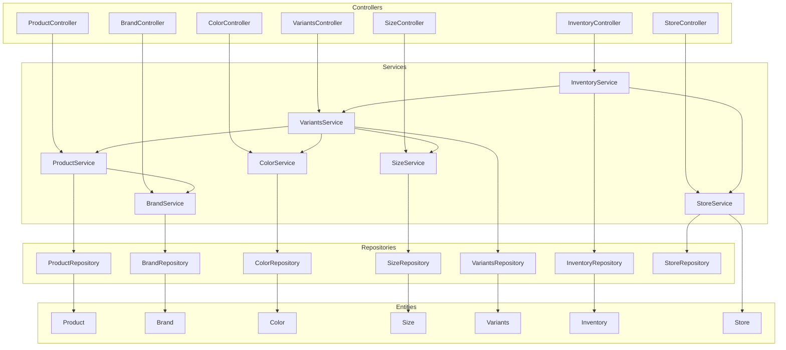

# System Architecture

This is shown as a flowchart to focus more on how components are grouped together.
This is mostly an overview for the planned interactions, future documentation to
be written is planned to focus on how components will interact: in particular
zooming into the services section.

